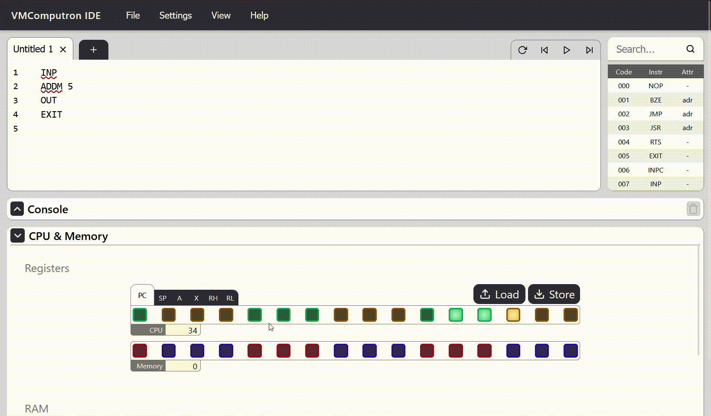
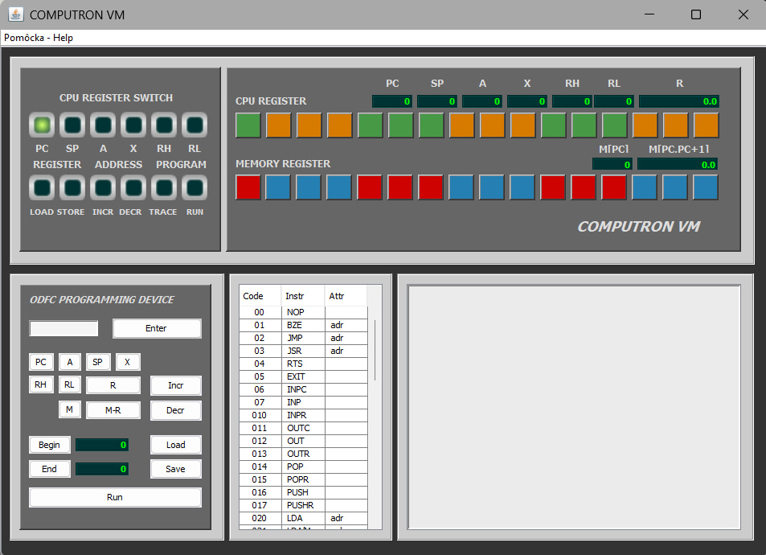

# ComputronVM Web
Group project for a university UI/UX course.

In a **limited timeframe**, we redesigned the user interface of **ComputronVM**, a program used for teaching the subject **Formal Languages**.  
Originally a **desktop Java (.jar) application**, it was transformed into a **web-based application**.  
The project focused on **frontend and UI/UX redesign** with **significant backend extensions** to support web functionality.

Preview:


## Previous Version
Before our redesign, **ComputronVM** was a simple desktop application in `.jar` format.  
The interface was **basic and intended for PC use only**, with minimal visual guidance for students and limited interactivity.



## My Contribution

- Implemented the **Registers UI** pixel-perfect based on an existing **Figma prototype**, including full client-side logic (**React, JavaScript**).  
- Developed a **responsive application layout** shared across the web interface.  
- Integrated the frontend with the backend via **WebSocket communication** (**Spring backend provided by other team members**).


## Manual launch:

#### 1. Clone the repository:
```
git clone git@github.com:Zabrafax/VMComputron.git
cd VMComputron
```

#### 2. Start the frontend first:

```
cd frontend
```

Install dependencies:

```
npm install
```

Start the React app:

```
npm run dev
```

Note: Check the port on which the frontend is running (usually http://localhost:3000).
If necessary, update the CORS configuration in the backend to allow requests from this port.


### 3. Setup and run the backend

```
cd ../backend
```

1. Open the project in **IntelliJ IDEA**.  
2. Locate the main class with `@VMComputronApplication`.  
3. Click **Run** (or use **Shift+F10**) to start the backend.  
4. The backend will start on the port defined in `application.properties` (usually 8080).

> ⚠ Make sure the frontend port is allowed in CORS configuration if needed.


## Technologies Used

* 
  
  
  
  
* 
  
  
* 
  


